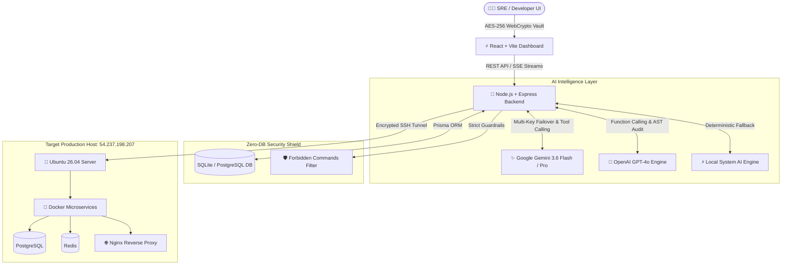

# D-OpsPilot AI (DOP) 🚀

> **Autonomous SRE & AI Incident Commander with WebCrypto Security Architecture**

[](https://opensource.org/licenses/MIT)
[]()
[]()
[]()
[](https://dopspilot.chandandev.online)

D-OpsPilot AI is an evidence-driven, autonomous DevOps/SRE AI agent designed for production incidents, real-time microservices management, and GitHub repository intelligence. It inspects live container logs, traces root-cause failures across health checks, correlates recent commits with outages, and executes recovery actions with human-in-the-loop safety guardrails.

---

## 📽️ System Architecture



---

## ⚙️ How D-OpsPilot AI Works

1. **Client-Side WebCrypto Security Vault**:
   - Server SSH private keys and GitHub access tokens are encrypted inside the user's browser using AES-256 WebCrypto.
   - Credentials are submitted only when executing SSH sessions and are never stored plain-text in server databases.

2. **Smart Key Parsing & Dynamic Key Files**:
   - When an SSH private key (PEM format `-----BEGIN...`) is supplied, the backend writes a temporary isolated key file with strict `0600` permissions.
   - Upon command completion, the temporary key file is automatically purged from disk.
   - Supports tilde path resolution (`~/.ssh/id_rsa_no_pass`) and automatic fallback to default host SSH keys.

3. **ANSI Control Sequence Sanitizer**:
   - Both backend and frontend include automatic ANSI and VT100 control character sanitization.
   - Terminal monitors (`htop`, `top`, `docker ps`) render clean, human-readable text tables without garbled formatting.

4. **Automated Project Cleanup**:
   - When a project workspace is deleted from the database, its local cloned repository folder (`backend/data/cloned_repos/<id>`) is immediately purged from server storage.
   - Background cleanup auto-purges any orphaned or inactive workspaces older than 3 days.

5. **Human-in-the-Loop Safety Approvals**:
   - High-risk operations (destructive commands, service restarts, code patches) require explicit operator confirmation before execution.

---

## 🌟 Key Features & Capabilities

- 🚀 **Autonomous Incident Commander**: AI-driven diagnosis of production outages (502 Bad Gateway, PostgreSQL connection limits, memory exhaustion).
- 📦 **1-Click AI Deployment**: Automates git sync, build, Docker container restart, and health check verification.
- 💻 **Interactive Remote SSH Web Terminal**: Real-time terminal with AI Copilot problem-to-command solver.
- 🕵️ **GitHub AST & Security Auditor**: Scans repositories for plain-text secrets, vulnerable dependencies, and unsanitized parameters.
- 🛡️ **Tech-Stack Chaos Engine**: Simulates live production outages tailored to your specific microservices stack.
- 📊 **Real-time SSE Terminal Streams**: Stream live container logs and diagnostic event timelines directly to the dashboard.

---

## 🛠️ Installation & Local Setup

### Prerequisites
- **Node.js**: v18.0.0 or higher
- **npm**: v9.0.0 or higher
- **Git**: Installed locally

### 1. Clone the Repository
```bash
git clone https://github.com/WildDragonDot/ops-pilot.git
cd ops-pilot
```

### 2. Install Dependencies
```bash
# Install root, backend, and frontend dependencies
npm run install:all || (npm install && cd backend && npm install && cd ../frontend && npm install)
```

### 3. Environment Setup

Create `.env` file in `backend/`:
```env
PORT=5080
DATABASE_URL="file:./dev.db"
JWT_SECRET="your-super-secret-jwt-key-min-32-characters"
GEMINI_API_KEY="your-google-gemini-api-key"
OPENAI_API_KEY="your-openai-api-key"
```

Initialize Prisma database schema:
```bash
cd backend
npx prisma db push
cd ..
```

---

## 🚀 Running the Application

### Option A: One-Command Start (Recommended)
```bash
./start.sh
```
This launches both the **Backend Service (port 5080)** and **Frontend Dashboard (port 5173 / 3000)** simultaneously.

Access the Web Dashboard at: **`http://localhost:5173`** or **`http://localhost:3000`**.

### Option B: Manual Start

**Start Backend:**
```bash
cd backend
npm run dev
```

**Start Frontend:**
```bash
cd frontend
npm run dev
```

### Stopping the Application
```bash
./stop.sh
```

---

## 🧪 Testing & Verification Guide

D-OpsPilot AI comes with a comprehensive End-to-End Master Test Suite covering 5 major system areas:

```bash
cd backend
npm test
```

### Test Suite Execution Scope:
1. **Authentication & RBAC Suite**: Password hashing, JWT issuance, and role hierarchy authorization.
2. **Project Management & Server Discovery**: Host parsing, command injection guardrails, and path traversal protection.
3. **AI Intelligence & Activities Suite**: AI prompt reasoning, AST code auditing, outage detection, and log analysis.
4. **Repository Auditor & AST Code Scan**: GitHub URL parsing, rate-limit handling, and secret scanning.
5. **Incidents & Safety Approval Queue**: Incident scenarios, failure injection transitions, and environment restoration.

To typecheck frontend and backend code:
```bash
# Backend Typecheck
cd backend && npx tsc --noEmit

# Frontend Typecheck
cd frontend && npx tsc --noEmit
```

---

## 🌐 Production Deployment

Deploy updated changes to the production server `ubuntu@54.237.198.207`:

```bash
./deploy-to-server.sh
```

This deployment script:
1. Tests SSH connectivity to `ubuntu@54.237.198.207`.
2. Syncs backend and frontend source files via SCP.
3. Compiles backend TypeScript (`tsc`) and restarts PM2 process `opspilot-backend`.
4. Builds Vite production bundle (`vite build`) and reloads Nginx reverse proxy.
5. Performs automated HTTP `/api/health` verification.

Live Production URL: **`https://dopspilot.chandandev.online`**

---

## 📡 REST API Reference

| Endpoint | Method | Description |
| :--- | :--- | :--- |
| `GET /api/health` | `GET` | Service health status check |
| `GET /api/projects` | `GET` | List all workspace projects |
| `POST /api/projects` | `POST` | Create a new project workspace |
| `DELETE /api/projects/:id` | `DELETE` | Delete project & auto-purge local cloned repos |
| `POST /api/projects/test-connection` | `POST` | Validate SSH server and GitHub repository credentials |
| `POST /api/server/execute` | `POST` | Execute authenticated remote SSH shell command |
| `POST /api/incidents` | `POST` | Initialize AI-driven incident investigation |
| `GET /api/incidents/:id/stream` | `GET` | Real-time Server-Sent Events (SSE) log stream |
| `POST /api/approvals/:id/approve` | `POST` | Operator sign-off for executing recovery action |
| `POST /api/repo/audit` | `POST` | Trigger repository AST security & vulnerability scan |

---

## 🛡️ Forbidden Command Guardrails

D-OpsPilot AI strictly blocks high-risk terminal commands at both the API and SSH execution layers:
- ❌ `rm -rf /` or `rm -r /` (Catastrophic file deletion)
- ❌ `mkfs` or `dd if=` (Disk partition wipe)
- ❌ `:(){ :|:& };:` (Fork bombs)
- ❌ `shutdown`, `reboot`, or `poweroff` (Server reboot)

---

## 📄 License

Developed with ❤️ by **Chandan Vishwakarma (WildDragon)**. Licensed under [MIT License](LICENSE).
